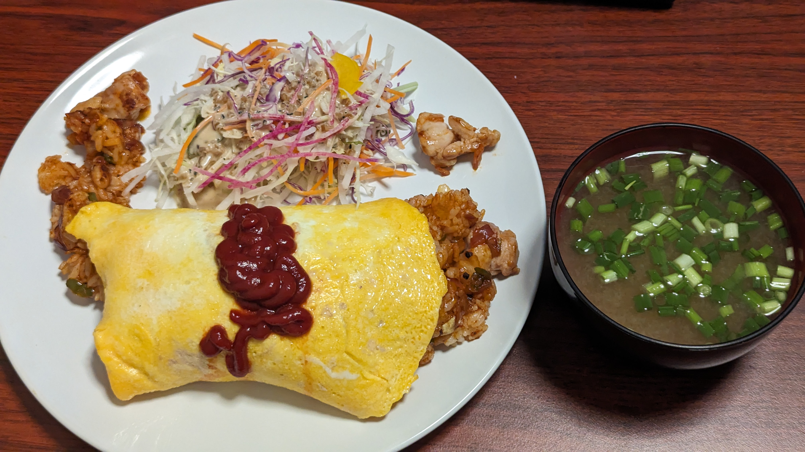

# Chicken Omurice

## 材料
* ご飯 一食分
  * 冷凍ごはんの場合はチンして温める
* 鶏もも肉 1/3枚
* 卵 2個
* ピーマン 半分
* 玉ねぎ 1/4
  * アーリーレッドでもよい
* サラダ油
* ケチャップ
* 塩
* 胡椒

## 作り方
1. ピーマンと玉ねぎを粗みじん切りにする
2. 鶏もも肉を小さめにぶつ切りする
3. 大きめの平皿にラップを敷く
4. 大きめのフライパンにサラダ油を敷いてまわし、溶き卵を入れて固める
5. 固めた卵を3の上に移す
6. サラダ油を少し追加しまわす。鶏もも玉ねぎピーマンを入れる。
7. 肉に火が通ったら塩コショウをふたつまみづつ、ケチャップを大さじ2ほど入れて混ぜ合わせる
8. ご飯を入れて全体的に着色するまで炒める
9. ご飯がまんべんなく赤くなったら卵の上に乗せる
10. ラップで全体を軽く包むようにしながらひっくり返して皿に盛る
11. ケチャップを卵の上にかける。量はスプーンで伸ばせば全体に行き渡りそうなくらい程度
## 参考
[チキンのシンプルオムライス](https://www.kurashiru.com/recipes/7a05f9d9-f947-472d-9d8e-6239c6174f5a)
## メモ
* 卵に味付けしようと思わないこと
  * ケチャップで味が乗るので卵に味を入れる必要は無い
  * 胡椒を入れると見た目がよくない
* 玉ねぎにアーリーレッドを入れると見た目が楽しい気がする

### 反省点
* 大きなフライパンでやったほうがよさそう。チキンライスを包めない
  * 御飯の量は欲張らない
* 鶏ももは大きすぎるぶつ切りは食べにくいのであまりよくなさそう
  * 多少大きさの違う塊があったほうが食感的には楽しそうではある
* パセリ忘れる