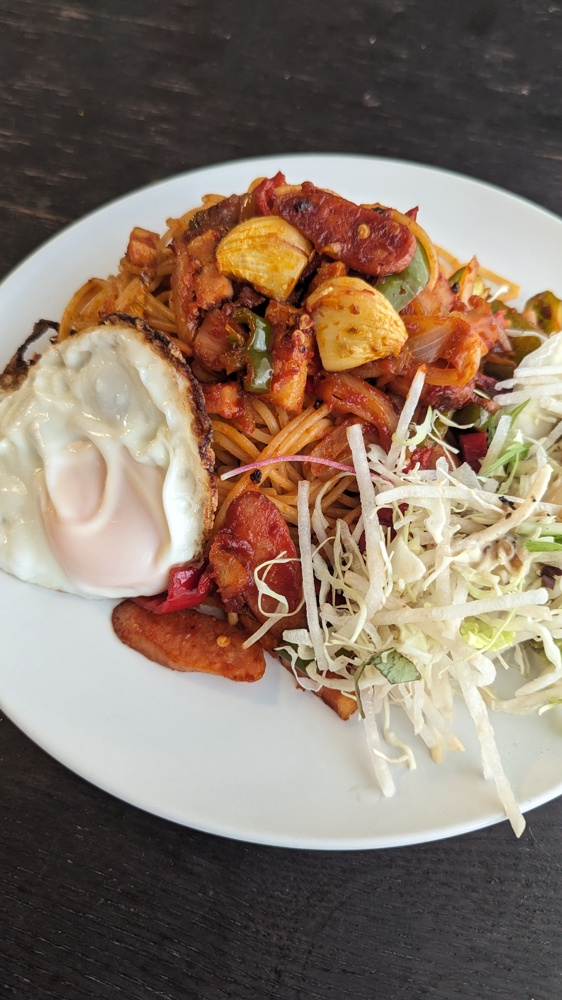

# ナポリタン

## 材料
### 具材
| 材料         | 量       | 備考               |
| :----------- | :------- | :----------------- |
| スパゲッティ | 1人前    | ナポリタン用or太め |
| 玉ねぎ       | 半分     |                    |
| ピーマン     | 2個      | あれば赤緑1個づつ  |
| ベーコン     | 30g      |                    |
| ウィンナー   | 2本      | 香燻               |
| にんにく     | ひとかけ |                    |

### 調味料
* トマトソース
  | 材料           | 量      | 備考 |
  | :------------- | :------ | :--- |
  | ケチャップ     | 大さじ3 |      |
  | トマトペースト | 大さじ1 |      |
  | 水             | 大さじ2 |      |

* 目玉焼き
  | 材料     | 量        | 備考                               |
  | :------- | :-------- | :--------------------------------- |
  | サラダ油 | 大さじ3~4 | 小さめフライパンの底がうまるくらい |
  | 卵       | 1個       |                                    |

* その他
  | 材料             | 量      | 備考           |
  | :--------------- | :------ | :------------- |
  | オリーブオイル   | 大さじ1 |                |
  | バター           | 5g      |                |
  | 塩               | 小さじ2 | パスタ茹で汁用 |
  | ブラックペッパー | 少々    |                |
  

## 作り方
1. パスタ用のお湯を沸かし始める
2. ピーマンのへた側を取り除き、縦に半分に切る。さらに横に細切りにする
3. にんにくは半分に切り芯を除いてから包丁でつぶす
4. 玉ねぎは薄切りにする
5. ウィンナーは斜めに細長くなるように切る
6. ボールにケチャップ大さじ3、トマトペースト大さじ1/2、水大さじ2を入れて混ぜ合わせる
7. フライパンにオリーブオイル大さじ1とにんにくを入れて弱火で加熱
8. にんにくの香りが立ったら火を中火にし、玉ねぎを入れて2分炒める
9. ベーコンとウィンナーを入れて2分炒める 
10. パスタを茹で始める(袋表記-1分)。塩は小さじ2
11. フライパンに戻りピーマンを入れ3分炒める
12. フライパンにトマトソースとブラックペッパーを入れ混ぜ合わせる
13. パスタが茹で上がったら湯切りし、フライパンに入れる。
14. フライパンにバター5gを追加し、色が染まるよう混ぜ合わせ、皿に盛る
15. フライパンを変えてサラダ油を敷いて中火で加熱
16. 温まったところで卵を割り入れ蓋をして1分。取り出してパスタに乗せる
    

## 参考
* [ナポリタンの作り方（ケチャップ味の濃厚レシピ）](https://www.sirogohan.com/recipe/naporitan/)  

## メモ
### 対応済/注意点
### 反省点/未対応
* 味のノリが悪いというか薄かった気がする
  * ソースも火が入りすぎて固くなってしまったのでどこかで茹で汁は入れたほうがいい気がする
  * レシピが2人前なのでソースを1人前換算で半分で作ったのが悪かったかも。パスタは一般的に言う2人前あったと思う。
* 目玉焼きは蓋して1分は長すぎると思う。30~45sかな
* ソース作りながらパスタ茹でるタイミングが難しい。忙しくはなるがウィンナー入れる前に茹で始めたほうがいいいかも。