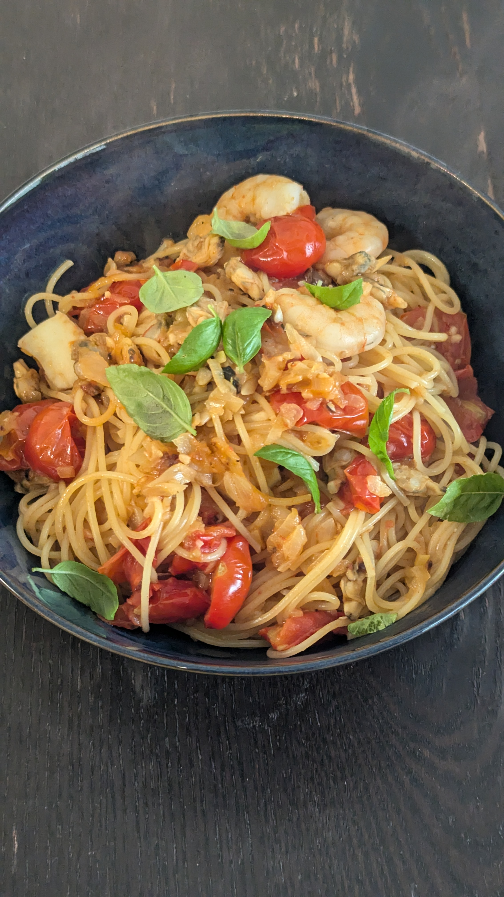

# 料理名

## 材料
### 具材
| 材料           | 量      | 備考                     |
| :------------- | :------ | :----------------------- |
| 国産にんにく   | 半かけ  |                          |
| たまねぎ       | 大で1/4 |                          |
| バジルの葉     | 適量    | バジルを楽しみたい口数分 |
| 冷凍エビ       | 3尾     | 中~大のものを使う        |
| 冷凍カットイカ | 3個     |                          |
| 冷凍あさり     | 適量    |                          |
| ミニトマト     | 170g    |                          |

### 調味料
  | 材料           | 量         | 備考     |
  | :------------- | :--------- | :------- |
  | 塩             | 小さじ半   | 解凍用   |
  | 塩             | ひとつまみ | ソース用 |
  | 塩             | 小さじ1    | パスタ用 |
  | 砂糖           | 小さじ半   |          |
  | 粗挽き胡椒     | 適量       |          |
  | コンソメ       | ひとつまみ |          |
  | オリーブオイル | 大さじ2    |          |

## 作り方
1. 冷凍の魚介類を水につけ塩をいれて解凍しておく
2. ミニトマトのヘタを取り立てに半割する
3. にんにくと玉ねぎを薄切りにする
4. オリーブオイルをフライパンに入れ、弱火で温めてからにんにくをいれる。香りが出たら玉ねぎを入れ焦げ付かないように混ぜていく
5. パスタ用のお湯を茹で始める
6. 玉ねぎに火が通ってきたら、砂糖、塩、胡椒、コンソメを入れ軽く混ぜ合わせてからミニトマトをいれる。
7. 5~10分程度焦げないようにソースを混ぜ合わせ続ける。
8. ミニトマトが崩れてきたら、パスタ鍋に塩とパスタをいれる。
9. フライパンの火を中火にしてから魚介類とパスタの茹で汁をいれて炒める。水分が少なくなったら適時茹で汁を加える。
10. 茹で上がった麺をフライパンに移し炒め合わせる。
11. お皿に盛り付けバジルの葉を散らす。

## 参考
* [フレッシュトマトでソースを作るなら、ミニトマトが断然おすすめ！ すぐ作れる黄金レシピ](https://www.kateigaho.com/article/detail/81219)

## メモ
### 対応済/注意点
* バジルの葉が大きい場合はちぎったほうがいい。噛んで口の中で香りを楽しむ感じ。
* 写真はしめじも入れたときのもの。レシピ記載の分量と多少ブレがある。
* 安物の冷凍エビは泥臭さがでる可能性があるため避けたほうが無難
### 反省点/未対応
* エビは半分に切ったほうがいいかもしれない
* バランス的に具材が余りがち。エビ1尾、イカ2切れにしてアサリを多め、ミニトマトは100~150gにしてもいいかもしれない。 
* ソースが麺と絡みあってない感じはする。ミニトマトといっしょに口に入れるとちょうどよいぐらい。