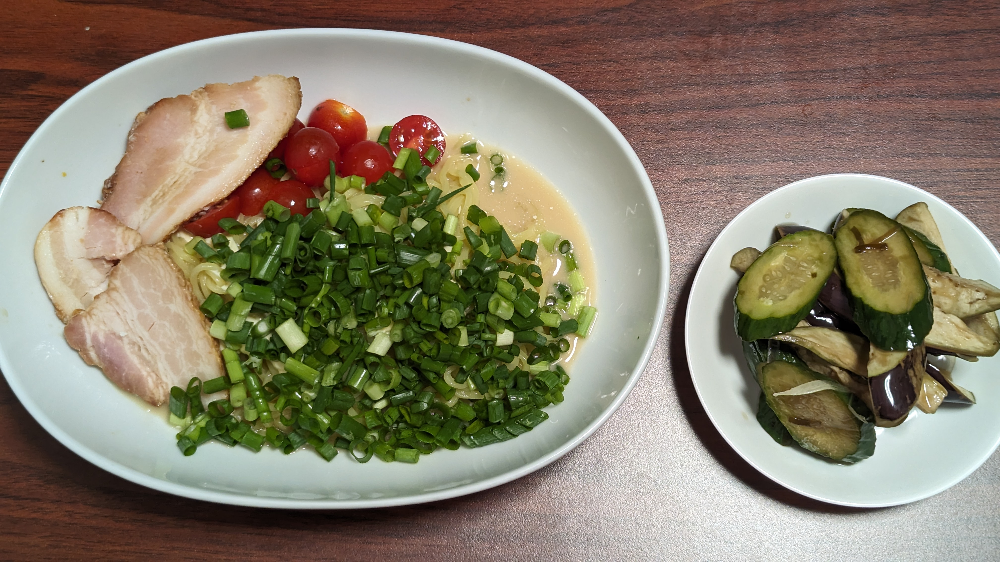

# 青ネギの冷やしマヨ中華

## 材料
* ちぢれ中華麺 一袋
* チャーシュー 数枚
* ミニトマト 数個
* 青ネギ 2~3本分
* マヨネーズ 大さじ1
* 醤油 大さじ1
* 鶏ガラスープの素 小さじ1/2
* ごま油 小さじ1/2
* 水 75ml
* 練りからし

## 作り方
1. 鍋にお湯を沸かす
2. 青ネギを小口切りに、ミニトマトを半分に切る
3. お湯が湧いたら鍋に麺を入れ、指定時間茹でる(冷やし)
4. マヨネーズ、醤油鶏ガラスープの素、ごま油をよく混ぜ合わせてマヨネーズソースを作る
5. 麺が茹で上がったらザルに取り水で熱とぬめりを取る
6. 麺の水気をしっかりとってから皿に盛り付ける
7. 作ったマヨネーズソースを麺にかける
8. 青ネギ、チャーシュー、ミニトマトを盛り付ける
9. 練りからしを1.5cmほど皿に添える

## 参考
[オレンジページ 2020年7/17号 P23](https://www.amazon.co.jp/dp/B0896Q1Q77)

## メモ
* からしを入れたほうがパンチと言うか締まりが出る
* 写真右の漬物は[森シェフのご飯がすすむ夏野菜漬け](https://www.youtube.com/watch?v=lf6PtmJaPDw)
### 反省点
* チャーシューは[御殿場高原バラ焼豚切り落とし](https://www.yonekyu.co.jp/product/detail.html?pdid=44)を使用。合わせるにはちょっと塩気が強かった。
* マヨネーズソースを作る時はちゃんと撹拌できる容器(ex.計量カップ)の方が良いと思われる。マヨネーズがダマに。
