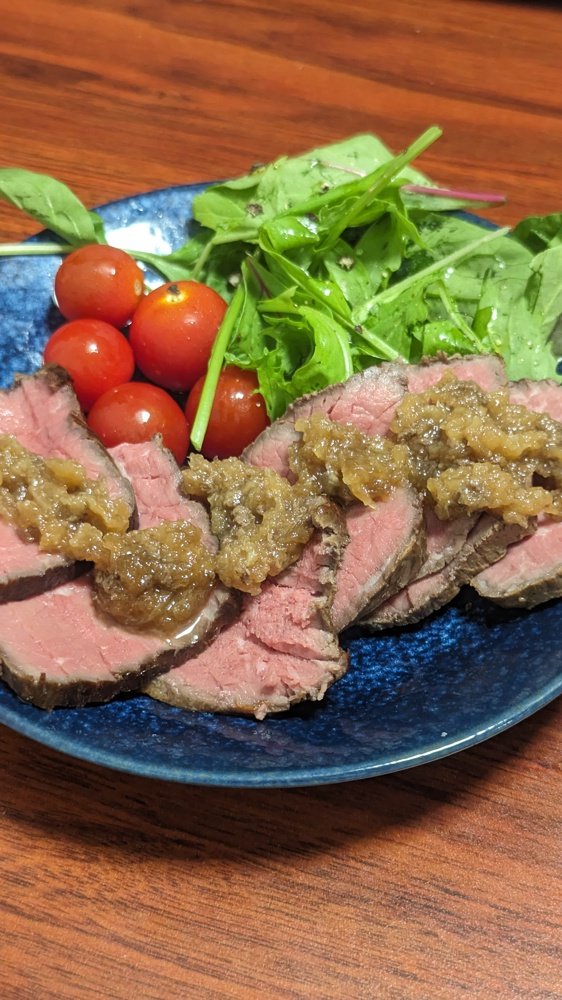

# ローストビーフ

## 材料
### 具材
| 材料           | 量     | 備考 |
| :------------- | :----- | :--- |
| 牛ももブロック | 約500g |      |

### 調味料
* ソース
  | 材料     | 量       | 備考 |
  | :------- | :------- | :--- |
  | 玉ねぎ   | 1/2      |
  | にんにく | ひとかけ |      |
  | 酒       | 大さじ2  |      |
  | みりん   | 大さじ2  |      |
  | 醤油     | 大さじ2  |      |
  | 砂糖     | 小さじ1  |      |

* 適時
  | 材料           | 量      | 備考               |
  | :------------- | :------ | :----------------- |
  | 塩             | 5g      | 肉の重量に対して1% |
  | オリーブオイル | 大さじ1 |                    |

## 作り方
1. 肉を常温に落ち着かせてから簡単に水洗い。キッチンペーパーでしっかり水を拭き取る。
2. 肉を耐熱のZiplockへ極力空気が入らないよう入れる。
3. 低温調理器を59度3時間40分でセット。準備ができたら肉を入れる。
4. 肉の低温調理が終わったら取り出し、肉の重量に対して1%の塩をZiplock内にある肉を転がしながら満遍なくまぶし冷蔵庫で半日寝かす。
5. 玉ねぎ半分と芯を取り除いたにんにくひとかけをすりおろす
6. すりおろしたものに酒大さじ2/みりん大さじ2/醤油大さじ2/砂糖小さじ1を入れて混ぜる。
7. フライパンにオリーブオイル大さじ1を入れ加熱。十分にフライパンが熱くなった段階で肉を入れて転がしながら焼き目をつける。
8. 肉を取り出し、フライパンそのままでソースとZiplockに残った肉汁を入れ中火で煮込む。
9.  沸騰してから3分を目安に、ある程度水分が飛び形が作れるようになった段階で別容器に引き上げて熱を取る
10. 肉を皿に盛り、その上にソースをかける

## 参考
* [しっとりやわらか♪低温調理器で作るローストビーフ](https://delishkitchen.tv/recipes/394170518682469427)
* [58℃ ローストビーフの低温調理 塩投入比較実験](https://boniq.jp/recipe/?post_type=recipe&p=4485)

## メモ
割りと失敗だったと思う
### 対応済/注意点
* 肉を切るときは厚すぎず薄すぎずひと思いに
  * 薄いほうがいいがやりすぎると端材のようになってしまい見た目が悪い
  * ギコギコすると断面が段々になってしまうのでなるべく長いストロークで包丁を入れる
* ソースはよかった
  * 肉汁足したのが良い
  * 若干味濃い目
  * ソースの温度は下がってた方がいいと思う。粗熱とりは冷蔵庫の急冷とパーシャルを活用した。
### 反省点/未対応
* 肉がぱさついている
  * レシピ系のサイト見ると低温調理期間は2時間~3時間なので短くしてもいいのかも
    * 500gだと4時間と書かれてるサイトもあるので今回もあながち間違いではなさそう。
  * レシピ系のサイトは低温調理前に焼き目をつける方法がちらほら。肉汁を止めるためらしい
  * 肉単体で食べるとパサツキが目立つがソースと合わせるとそこまでではない気もする
* 肉にまぶす塩は多い気がする
  * 肉の重量に対して塩の重さは0.5~0.8%にしてもいいかも