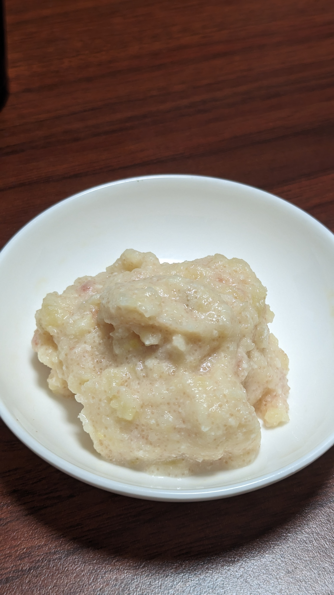

# 明太マッシュポテト

## 材料
### 具材
| 材料       | 量             | 備考 |
| :--------- | :------------- | :--- |
| じゃがいも | 500円玉大を2個 |      |
| 明太子     | 切子一つ       |      |

### 調味料
* 仕上げ
  | 材料   | 量   | 備考 |
  | :----- | :--- | :--- |
  | 牛乳   | 50ml |      |
  | バター | 5g   |      |

## 作り方
1. じゃがいもをよく洗う
2. 鍋に水を入れ中火で沸騰させる
3. 沸騰したらじゃがいもをいれる
4. 10分を目安に、芋に串が通るようになったら引き上げてザルに入れる
5. 流水にかけて冷ましながら皮を剥く
6. 皮を向いたじゃがいもをボールに入れてフォークで潰す。小さくなってきたらスプーンで潰しなめらかにしていく
7. 牛乳50ml、バター5gを入れて混ぜ合わせる
8. 冷蔵庫で冷やし適温になったら盛り付ける

## 参考
* [ピリッとがくせになる、マッシュ辛子明太ポテト](https://oceans-nadia.com/user/406408/recipe/434169)

## メモ
### 対応済/注意点
* 明太子があるので塩は不要
* バターは香り高いものを選んだほうがよさそう
* じゃがいも1個がかなり小さかった。改めて作る際は分量を考えたほうが良さそう。
### 反省点/未対応
* 牛乳入れすぎてゆるくなった。半分でもいい気がする。
* 単体で食べるなら黒胡椒入れたほうがおいしいと思う
