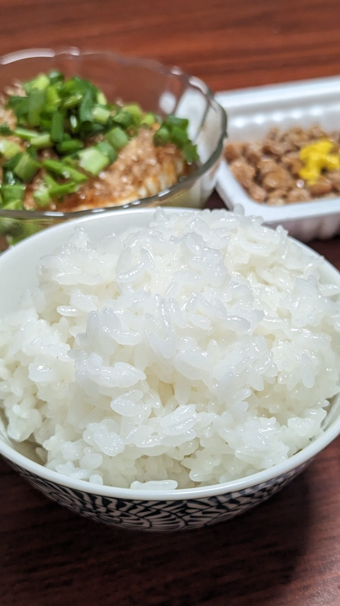

# 米を炊く

## 材料
### 具材
| 材料 | 量    | 備考           |
| :--- | :---- | :------------- |
| 米   | 3合   |                |
| 水   | 540ml | 1合180mlで計算 |

### 調味料
* 炊く前の味付け
  | 材料     | 量         | 備考 |
  | :------- | :--------- | :--- |
  | ハイミー | 1~3振り    |      |
  | 米油     | ひとまわし |      |

## 作り方
1. 米をザルに入れ流水で研ぐ
2. ざるをボールに入れ水を入れながら研ぐ。満水になったら水を止め20~30秒ほど研ぎ水を捨てる
3. 2を1~2度繰り返す
4. 研ぎ水を捨て、ボールにざるをいれて満水にし、きっかり10分浸水させる
5. 10分経過後、ざるを上げて米から水気をしっかり切り、10分以上放置する。
6. 圧力鍋に米と水、ハイミー1~3振りと米油ひとまわしを入れ、火にかける。火の強さは釜マーク(弱~中)。目安は10分程度だが、ガスレンジの安全装置が発動するまで放置で良い。
7. 火が止まったら圧力鍋の重りを傾け、強制的に減圧する。蒸気が噴き出るの注意する。
8. 圧力鍋の蓋を開ける際、裏蓋に溜まった水がお米にかからないように注意する

## 参考
* [米を炊く](https://note.com/blaue_fuchs/n/ncfd64b86852e)  
* [ごはんを圧力鍋で炊ける？メリットや圧力鍋での炊き方、注意点をおさえよう](https://www.gohansaisai.com/fun/entry/detail.html?i=791)

## メモ
### 対応済/注意点
* 米とぎは計画的に。乾燥工程で常温1日放置したら変な匂いした
* 炊飯時に思い立ってもう一回研いではいけない。だいぶゆるくなる
### 反省点/未対応
* 強制減圧した場合/しない場合の比較ができてない